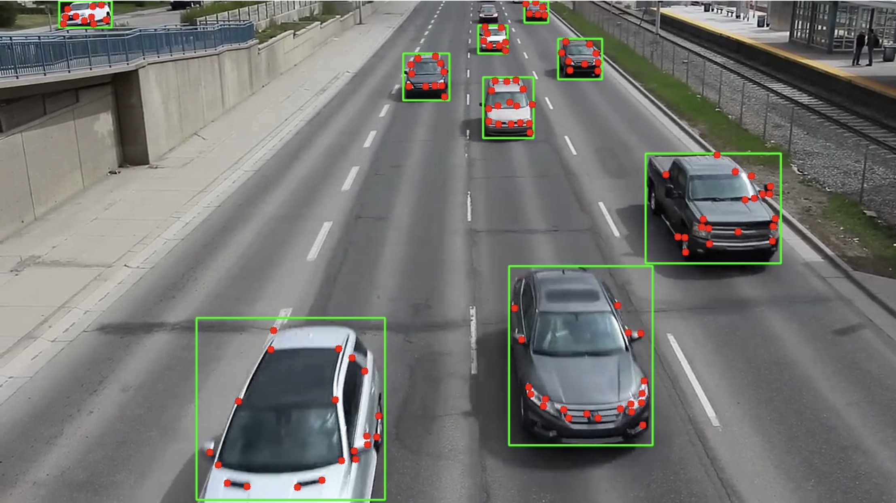
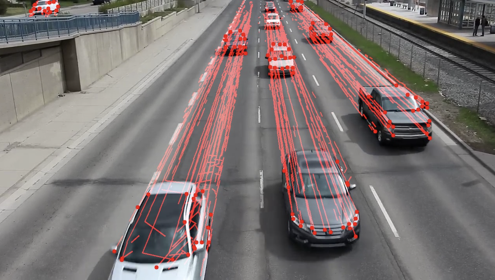
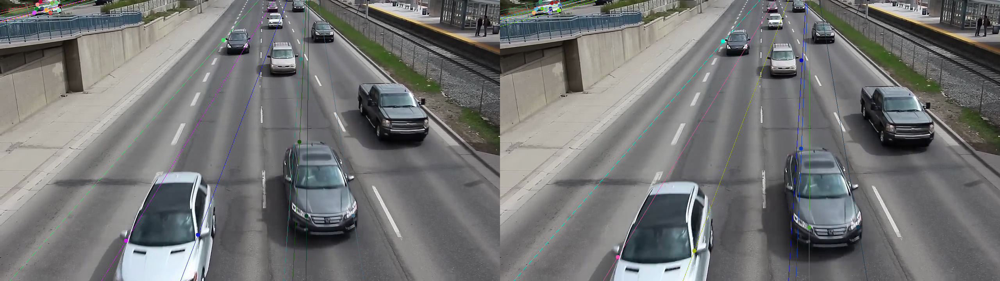

# Computer Vision Project 2025

This project implements various vehicle detection methods using computer vision techniques:
1. CV2 background removal
2. YOLOv8 object detection
3. Semantic segmentation with SegFormer

## Environment Setup

```bash
# Create a virtual environment
python -m venv venv

# Activate virtual environment
# On Windows:
venv\Scripts\activate
# On macOS/Linux:
source venv/bin/activate

# Install dependencies
pip install -r requirements.txt
```

## Methods

### 1. Background Subtraction (CV2)
Uses OpenCV's background subtractor to detect moving objects in video.

### 2. YOLOv8 Object Detection
Implements YOLOv8 to identify and classify vehicles with bounding boxes.

### 3. SegFormer Semantic Segmentation
Uses a pre-trained SegFormer model to perform pixel-level segmentation of vehicles.

## Feature Detection, Tracking, and Fundamental Matrix Estimation (`2_feature_detection_and_calibration.ipynb`)

This part of the project focuses on identifying salient features on objects (vehicles) in a video sequence, tracking these features across frames, and using the resulting point correspondences to estimate the Fundamental Matrix, which encapsulates the epipolar geometry between two views.

### Discussion on Initial Approaches

Initially, concepts like using vanishing points for camera calibration or pose estimation were discussed. However, the current approach shifted towards feature-based methods due to the complexity and potential instability of vanishing point estimation in dynamic scenes without strong parallel line structures.

### Phase 1: Vehicle Detection & Feature Extraction

*   **Goal:** Identify vehicles in the video and extract robust feature points (corners) located on these vehicles.
*   **Method:**
    *   **Vehicle Detection:** Uses a pre-trained YOLOv8 model (`yolov8n.pt`) to detect objects classified as cars, trucks, or buses, providing bounding boxes.
    *   **Feature Extraction:** Within each detected vehicle's bounding box, the Shi-Tomasi corner detection algorithm (`cv2.goodFeaturesToTrack`) is applied to find visually distinct points suitable for tracking.
*   **Camera Intrinsics (`K`):** A placeholder intrinsic matrix `K` is defined based on video dimensions. For accurate 3D reconstruction, this should be replaced with results from actual camera calibration.
    ```
    K = [[fx, 0, cx],
         [0, fy, cy],
         [0, 0, 1]]
    ```

*   **Output Example:** (Place image here)
    
    
    


### Phase 2: Feature Tracking (KLT)

*   **Goal:** Track the features detected in Phase 1 across subsequent video frames.
*   **Method:** The Kanade-Lucas-Tomasi (KLT) optical flow algorithm (`cv2.calcOpticalFlowPyrLK`) is used. It estimates the displacement of the feature points from one frame (`prev_gray`) to the next (`current_gray`).
*   **Track Management:** An `active_tracks` dictionary maintains the history of each tracked point. A consistency check (based on the cosine similarity of motion vectors) helps filter out potentially unreliable tracks.
*   **Output:** Point correspondences (`good_old`, `good_new`) representing the position of the same feature in the previous and current frames, respectively.

*   **Output Example:** (Place image here)
    
    
    
   

### Phase 3: Fundamental Matrix Estimation (Goal)

*   **Goal:** Estimate the Fundamental Matrix `F` using the point correspondences obtained from KLT tracking. `F` relates corresponding points `x` in the first image and `x'` in the second image according to the epipolar constraint: `x'^T F x = 0`.
*   **Method:** The `cv2.findFundamentalMat` function is used. It typically employs the RANSAC (Random Sample Consensus) algorithm to robustly estimate `F` even in the presence of outlier matches (incorrect point correspondences). A minimum of 8 point correspondences is required.
*   **Application:** The Fundamental Matrix allows for calculating epipolar lines, which represent the projection of a 3D point onto the second image, given its projection in the first image. This is a crucial step towards understanding the camera's relative motion and potentially 3D scene structure.

*   **Output Example (Conceptual):** (Place image here showing epipolar lines)
    
    

the context of the Fundamental Matrix, the "first" and "second" images refer to:

First image: The previous frame from the video sequence
In your code, this is last_frame_prev
It contains the points we call good_old or pts1
In the visualization, it's usually shown on the left side labeled "Epilines on Frame (Prev)"
Second image: The current frame from the video sequence
In your code, this is last_frame_current
It contains the points we call good_new or pts2
In the visualization, it's usually shown on the right side labeled "Epilines on Frame (Current)"
These two frames are consecutive images captured a short time apart (1/FPS seconds). The Fundamental Matrix F describes the geometric relationship between these two viewpoints.

When we say "the epipolar line in the second image," we mean the line in the current frame where a point from the previous frame could potentially match. Similarly, epipolar lines in the first image show where points from the current frame could match in the previous frame.

The time difference between these frames is quite small, which is why the images look very similar - but the slight differences contain valuable information about the camera motion and 3D scene structure


### Project Direction and Next Steps

While the initial project plan proposed using specific symmetric features (like vehicle lights) and vanishing points (VPs) for 3D localization and trajectory estimation, the implementation has evolved. The current approach utilizes general feature points (Shi-Tomasi corners on detected vehicles) tracked via KLT, followed by Fundamental Matrix (`F`) estimation.

**Reasons for Divergence:**
*   Calculating vanishing points robustly can be challenging in dynamic scenes without clear, persistent parallel lines.
*   Relying on specific symmetric features requires robust identification, which might be difficult across different vehicle types and viewing angles.

**Current Path via Epipolar Geometry:**
*   The implemented method (feature detection -> KLT tracking -> Fundamental Matrix estimation) is a standard and often more robust approach in structure-from-motion problems.
*   The Fundamental Matrix (`F`) successfully captures the geometric relationship (epipolar geometry) between two consecutive camera views.

**Alignment with Original Goal:**
This path can still achieve the original goal of analyzing vehicle shape, trajectory, speed, and time-to-impact, but requires further steps:

1.  **Camera Calibration (CRITICAL):** The current placeholder Camera Intrinsics matrix `K` must be replaced with an accurate matrix obtained through a proper calibration procedure (e.g., using a chessboard). Accurate `K` is essential for any metric 3D reconstruction.
2.  **Essential Matrix (`E`):** Using the calibrated `K` and the computed `F`, calculate the Essential Matrix: `E = K^T * F * K`.
3.  **Camera Pose Recovery:** Decompose the Essential Matrix `E` (e.g., using `cv2.recoverPose`) to find the relative camera Rotation (`R`) and Translation (`t`) between the two frames. Note: The translation `t` is only determined up to an unknown scale factor.
4.  **Triangulation:** Use the camera poses (`K`, `R`, `t`) and the 2D inlier correspondences (`pts1_inliers`, `pts2_inliers`) to triangulate the 3D positions of the tracked points relative to the camera (using `cv2.triangulatePoints`). These 3D points will also be scaled by the unknown factor from `t`.
5.  **Scale Recovery:** This is the key step to achieve *metric* results (meters, m/s). The unknown scale factor must be determined. Potential methods include:
    *   **Known Object Size:** Identifying tracked points corresponding to an object feature with a known real-world dimension (e.g., the distance between headlights, vehicle width).
    *   **Known Camera Motion:** If the camera's displacement between frames is known.
    *   **Known Scene Geometry:** Utilizing known scene dimensions, like camera height above the ground plane.
6.  **Trajectory Construction:** Extend the process over multiple frames, accumulating relative poses (scaled `R` and `t`) to reconstruct the camera's trajectory and the 3D trajectories of tracked points.
7.  **Metric Analysis:** Once the scale is known, derive metric speeds and potentially estimate time-to-impact from the 3D trajectories.

**Conclusion:** The project is on a valid path, but requires completing the calibration, pose estimation, triangulation, and scale recovery steps to achieve the desired metric analysis of vehicle motion.
